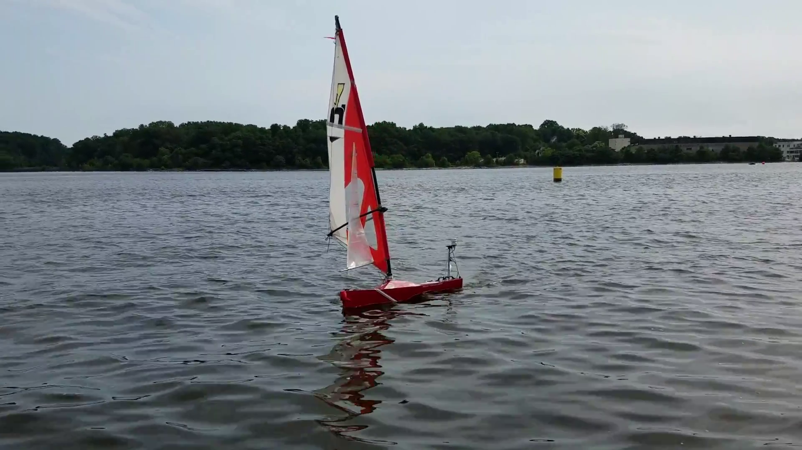
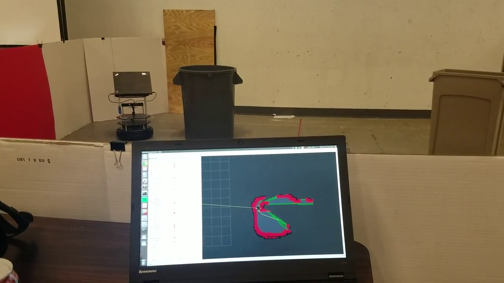
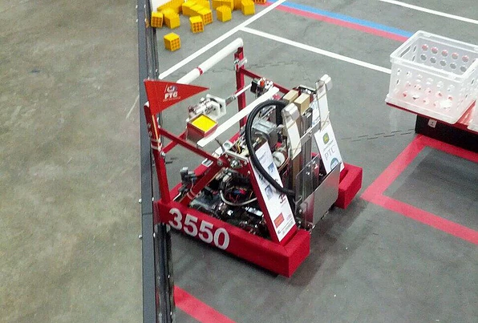
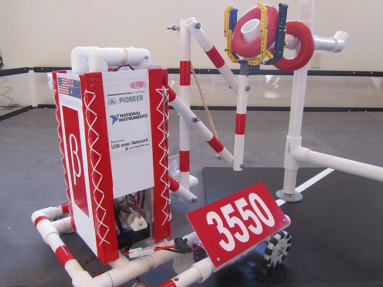
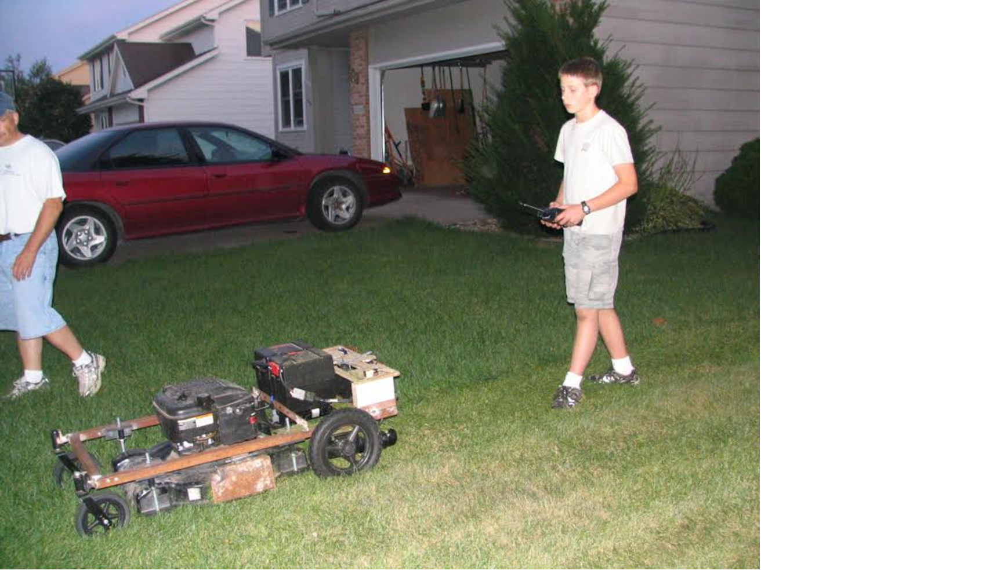

# About
Robotics geek, and entrepreneur, distance runner.  I am passionate about learning new things and exploring new opportunities.  When not working on cool projects or mentoring several FIRST robotics teams, I can often be found running trails, exploring the great outdoors, or learning something new.  As a student tackling a double major in Robotics Engineering and Computer Science at Worcester Polytechnic Institute I also mange to find time to learn new skills and explore interests in visual arts.

# Personal Mission
To work on awesome robotics projects that expand my capabilities, that matter to the rest of the world, and improve people's lives.  I am energized by helping others learn and grow, and am motivated to work on projects that make a positive difference in the world.

# Projects

## Autonomous Sailboat
Developed a vision based system to detect buoys floating on the water as part of the 2017 International Robotic Sailing Regatta (Sailbot). System consists of a Raspberry Pi Zero, RPi Camera V2, OpenCV, and wireless networking to send buoy location information to the boat.

## Autonomous Mapping Turtlebot
Programmed a Turtlebot 2 to map and explore an unknown environment. Robot implemented Gmapping SLAM algorithm to generate maps, segmented occupied, free, and unknown space, and used A* to plan paths to unexplored frontiers in the environment. Algorithms were first validated in simulation using Gazebo before being implemented on the robot with Python.

## Gemini: FIRST Tech Challenge Robot
This robot was designed and created for the 2014 FTC Season "Block Party!"  As a **one-student team**, I designed, built, programmed, tested, and drove this robot all the way to the World Championships.  In my spare time I had the opportunity to develop more advanced software that would detect the robot connection state, and other system statuses and display relevant information on a strip of addressable LEDS.  With this robot, I also custom designed and fabricated a dog-clutch for a Power-Take-Off from the drivetrain motors to use for hanging.  

## Apollo: Tele-Connect Robot
From what started as a spark of inspiration, this robot was designed as part of the Tele-Connect project that I initiated and piloted with friends from Sydney Australia.  Apollo was designed so that it was light-weight, low-cost, and durable enough to shipped around the entire world while still fitting in a small package for easy shipping.  Through the Tele-Connect project, I was able to control Apollo from my basement in Iowa in a robotics competition all the way in Sydney, Australia, and was later able to have children in Australia drive the robot in my basement.  

## RC Lawnmower
What began as a way out of pushing a lawnmower became one of my first robotics projects.  Between 5th and 6th grade I learned all about motor controllers, remote control, and robotics drivetrains on my own, and got some help welding the frame together.  After some scrapes, burns, and learning the smell of fried electronics, I was able to mow the lawn remotely for several summers.

